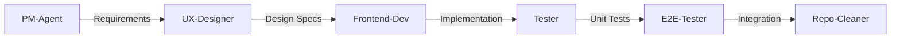
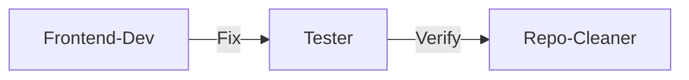
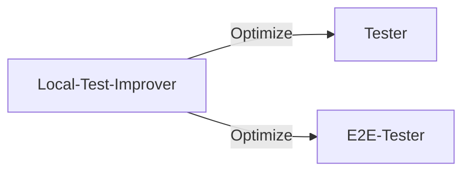

# Agent Management System

## Overview
This system provides a comprehensive framework for creating, managing, and orchestrating specialized agents for the Bewirtungsbeleg application. Each agent has specific responsibilities and works together in coordinated workflows.

## Quick Start

### Using an Agent
```
1. Identify the task type
2. Select appropriate agent(s) from registry
3. Follow the agent's workflow
4. Validate results with quality gates
```

### Agent Selection Guide

| Task Type | Primary Agent | Supporting Agents |
|-----------|--------------|-------------------|
| New Feature | PM-Agent → UX-Designer → Frontend-Dev | Tester, E2E-Tester |
| Bug Fix | Frontend-Dev | Tester, Repo-Cleaner |
| Performance | Local-Test-Improver | Tester, E2E-Tester |
| Cleanup | Repo-Cleaner | - |
| Requirements | PM-Agent | Meta-Architect |
| UI Changes | UX-Designer → Frontend-Dev | Tester |
| Testing | Tester, E2E-Tester | Local-Test-Improver |

## Agent Workflows

### 1. Feature Development Flow


**Steps:**
1. PM-Agent analyzes requirements and creates user stories
2. UX-Designer creates UI specifications using Mantine
3. Frontend-Dev implements with TypeScript/React
4. Tester writes unit and integration tests
5. E2E-Tester creates Playwright scenarios
6. Repo-Cleaner optimizes file structure

### 2. Quick Fix Flow


### 3. Testing Optimization Flow


## Agent Commands

### Initialize Agent System
```bash
# First time setup
cat .claude/registry/agents.json | jq '.agents[].name'
```

### Check Agent Status
```bash
# View all active agents
cat .claude/registry/agents.json | jq '.agents[] | select(.status=="active") | .name'
```

### Agent Metrics
```bash
# View agent performance
cat .claude/registry/agents.json | jq '.agents[] | {name: .name, success: .metrics.successRate}'
```

## Best Practices

### 1. Agent Selection
- Use the minimal set of agents needed
- Follow the dependency chain
- Respect agent boundaries

### 2. Task Handoff
- Always use TodoWrite for task tracking
- Clear acceptance criteria between agents
- Validate previous agent's work

### 3. Quality Gates
Each agent must verify:
- ✅ TypeScript compilation (`yarn build`)
- ✅ Tests passing (`yarn test`)
- ✅ Linting clean (`yarn lint`)
- ✅ German locale formatting
- ✅ No console errors

### 4. File Management
- **Prefer editing** over creating new files
- **Consolidate** similar functionality
- **Clean up** after implementation
- **Follow** existing patterns

## Coordination Patterns

### Sequential Execution
```typescript
// Agents work in order, each depending on previous
const workflow = [
  'pm-agent',
  'ux-designer',
  'frontend-dev',
  'tester'
];
```

### Parallel Execution
```typescript
// Independent agents work simultaneously
const parallel = [
  'tester',
  'e2e-tester',
  'local-test-improver'
];
```

### Conditional Execution
```typescript
// Agents triggered based on conditions
if (hasNewFiles) {
  activateAgent('repo-cleaner');
}
if (testsFailing) {
  activateAgent('local-test-improver');
}
```

## Common Scenarios

### Scenario 1: Adding OCR Enhancement
1. **PM-Agent**: Define OCR improvement requirements
2. **UX-Designer**: Design better upload UI
3. **Frontend-Dev**: Implement with OpenAI Vision API
4. **Tester**: Mock OpenAI responses, test extraction
5. **E2E-Tester**: Test full upload → OCR → form flow
6. **Repo-Cleaner**: Consolidate OCR utilities

### Scenario 2: German Compliance Update
1. **PM-Agent**: Research new regulations
2. **Frontend-Dev**: Update validation schemas
3. **Tester**: Test new validation rules
4. **E2E-Tester**: Verify complete workflows

### Scenario 3: Performance Issues
1. **Local-Test-Improver**: Profile slow tests
2. **Frontend-Dev**: Optimize components
3. **Tester**: Verify optimizations
4. **Repo-Cleaner**: Remove unused code

## Troubleshooting

### Agent Conflicts
- Check `agents.json` for dependencies
- Verify no parallel modifications to same files
- Use Meta-Architect to mediate

### Failed Quality Gates
- Run `yarn lint` for style issues
- Run `yarn test` for test failures
- Check TypeScript errors with `yarn build`
- Review German formatting in UI

### Performance Issues
- Activate Local-Test-Improver
- Check for redundant file operations
- Review agent metrics in registry

## Maintenance

### Weekly Review
1. Check agent utilization
2. Update agent metrics
3. Identify unused agents
4. Optimize workflows

### Agent Updates
1. Update version in `agents.json`
2. Document changes in agent file
3. Test with sample tasks
4. Update this guide if needed

## Emergency Protocols

### Build Broken
```bash
# Immediate actions
yarn lint          # Check linting
yarn test:ci       # Run critical tests
yarn build         # Verify build
git status         # Check changes
```

### Test Failures
1. Activate Tester agent
2. Isolate failing tests
3. Check recent changes
4. Verify mocks are updated

### Type Errors
1. Run `yarn build`
2. Check imports
3. Verify type definitions
4. No `any` types allowed

## Success Metrics

### Code Quality
- Zero TypeScript errors
- 100% critical path test coverage
- Clean linting reports
- German locale consistency

### Efficiency
- < 5 min for standard tasks
- < 3 files modified per feature
- > 95% first-attempt success

### Maintainability
- Clear file organization
- No duplicate code
- Consistent patterns
- Comprehensive tests